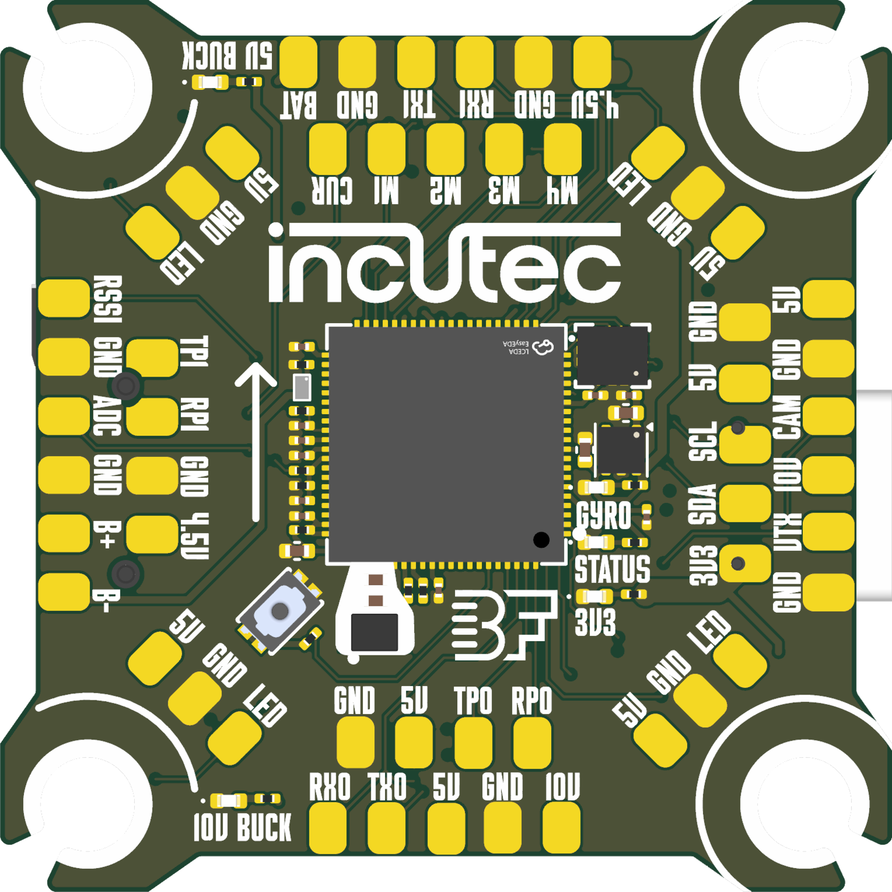

# OpenFC-Lite

Open-source Betaflight flight controller built on the RP2354B, part of the incutec OpenDrone line. 6-layer PCB, 30.5 x 30.5 mm mounting pattern, 3S-6S input, microSD blackbox, PIO-driven analog OSD. Motor outputs are signal-level DShot lines to an external 4-in-1 ESC over the standard 8-pin connector; there are no onboard motor drivers, barometer, or integrated receiver. A smaller sibling, [OpenFC-Lite-Mini](https://github.com/incutec-hw/OpenFC-Lite-Mini) (20 x 20 mm, RP2354A), shares this design. Designed in KiCad 10 for JLCPCB assembly. Full design detail: [hardware/docs/DESIGN.md](hardware/docs/DESIGN.md).

<p>


</p>

## Status

**Hardware validated**, Rev 2, flown.
Rev 2 boards fly with a rework pin mapping baked into the Betaflight target (`OPENFC_LITE_RP2350B`). The Rev 3 change list collected during Rev 2 bring-up is staged in [hardware/docs/REV3_CHANGELIST.md](hardware/docs/REV3_CHANGELIST.md). Revision history: [CHANGELOG.md](CHANGELOG.md).

## Certification

<a href="https://certification.oshwa.org/be000026.html">
  <picture>
    <source media="(prefers-color-scheme: dark)" srcset="images/oshwa-certified-dark.svg" />
    
  </picture>
</a>

OpenFC-Lite is **certified open source hardware** by the [Open Source Hardware Association](https://www.oshwa.org/), OSHWA UID **[BE000026](https://certification.oshwa.org/be000026.html)**.

## Links

- Product page: [opendrone.be/products/openfc-lite](https://opendrone.be/products/openfc-lite)
- Video channel: [JustFPV on YouTube](https://www.youtube.com/@justfpv1432)

## Specifications

| Parameter | Value |
|---|---|
| MCU | RP2354B, dual-core ARM Cortex-M33, QFN-80, 2 MB stacked flash |
| IMU | LGA-14 site on SPI0, dedicated 1.8 V analog rail; schematic carries LSM6DSV16XTR, Rev 2 built with BMI270 (see [DESIGN.md](hardware/docs/DESIGN.md)) |
| Blackbox | microSD push-push slot on SPI1 (no onboard SPI flash) |
| OSD | Analog, PIO-driven discrete chain (comparator, op-amp, SPDT switch), no OSD ASIC |
| UARTs | 4: 2 hardware + 2 PIO software UARTs |
| Motor outputs | 4 signal-level DShot lines to an external 4-in-1 ESC |
| Input | +BATT, 3S-6S LiPo |
| USB | USB-C, configuration and flashing |
| PCB | 6-layer, 38.9 x 38.9 mm; 30.5 x 30.5 mm mounting, 4x 4.0 mm holes |

Part-level detail (regulators, OSD chain, connector pinouts) is in [hardware/docs/DESIGN.md](hardware/docs/DESIGN.md).

## Repository layout

| Path | Contents |
|---|---|
| `hardware/` | KiCad 10 project: schematics, PCB, panel, project-local libraries |
| `hardware/docs/` | Design documentation ([DESIGN.md](hardware/docs/DESIGN.md), [REV3_CHANGELIST.md](hardware/docs/REV3_CHANGELIST.md)) |
| `hardware/tools/` | Analysis and metadata scripts (kicad-skip / pcbnew) |
| `hardware/production/` | Fabrication exports per revision (generated, not tracked in git) |
| `libs/KiCad-Library` | Shared Incutec symbol/footprint/3D library (git submodule) |
| `images/` | Board renders and certification marks |

## Design entry points

- Root schematic: `hardware/OpenFC.kicad_sch`, six sub-sheets: `rp2350a` (MCU, USB, crystal), `power`, `imu`, `osd`, `blackbox`, `pads`
- Board layout: `hardware/OpenFC.kicad_pcb`, 6 copper layers
- Panel for production: `hardware/OpenFC_Panel.kicad_pro` / `hardware/OpenFC_Panel.kicad_pcb`
- `hardware/_filltest.kicad_pro` is a fill-test scratch project

Libraries are project-local (`hardware/lib.kicad_sym`, `hardware/lib.pretty/`, `hardware/lib.3dshapes/`); the project lib tables also reference the shared `Incutec` library from the `libs/KiCad-Library` submodule, used for new parts. Clone with `--recursive` so those references resolve.

## Build and export

```
git clone --recursive https://github.com/incutec-hw/OpenFC-Lite.git
```

Open `hardware/OpenFC.kicad_pro` in KiCad 10. Production exports (gerbers, BOM, CPL) are generated with the [KiCad Fabrication Toolkit](https://github.com/bennymeg/Fabrication-Toolkit) plugin. Headless checks and exports use `kicad-cli`:

```
kicad-cli sch erc --exit-code-violations hardware/OpenFC.kicad_sch
kicad-cli pcb drc --exit-code-violations hardware/OpenFC.kicad_pcb
kicad-cli pcb export gerbers -o out/ hardware/OpenFC.kicad_pcb
```

## Manufacturing

Fabricated and assembled at JLCPCB: 6-layer board, LCSC parts. Per-revision BOM, CPL, and gerber sets are generated into `hardware/production/` (gitignored) from the panel project with the Fabrication Toolkit, using the tracked `hardware/fabrication-toolkit-options.json`. Revision history: [CHANGELOG.md](CHANGELOG.md).

## Contributing

See [CONTRIBUTING.md](CONTRIBUTING.md).

## License

Hardware licensed under [CERN-OHL-S-2.0](https://ohwr.org/cern_ohl_s_v2.txt). See [LICENSE](LICENSE).
